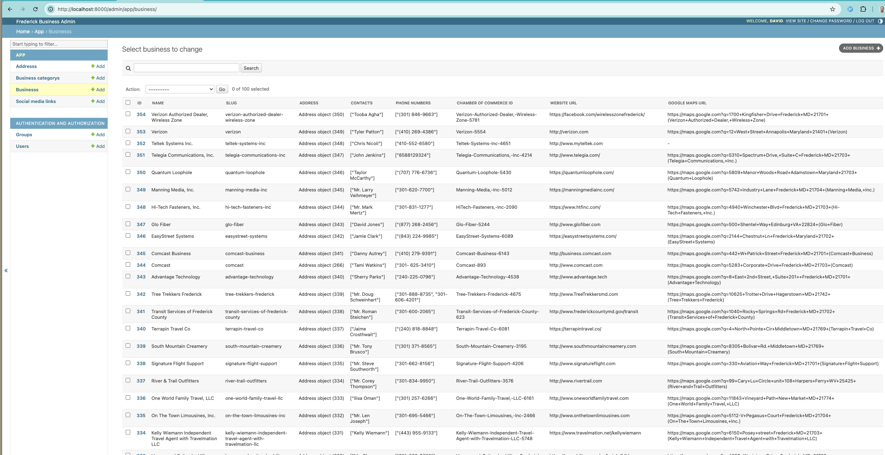

## Frederick Business Directory

I was wanting to get a better idea of the businesses in frederick,
so i started a project to make a directory of businesses.

I started with the Frederick Chamber of Commerce, and may add more sources in the future.

The output file can be found in [./db.yaml](./db.yaml)

Visual of what the data looks like in django admin interface:



### Overview

This repository contains a Django project integrated with Scrapy for web scraping and structured data ingestion.

The primary components include:

- Django Application (app/): Only for models/db and admin interface.

- Scrapy Spiders (scraper/): Web scrapers that extract business data and store it in the Django database.

- `Pipelines`: Processes Scrapy data and saves it into Django models.

- `Makefile`: Simplifies common tasks like running the server, opening the Django shell, running scrapers, and dumping database data.

### Codebase Structure

Django Application (app/)

- `models.py`: Defines database models including businesses, categories, addresses, and social media links.

- `admin.py`: Custom Django admin views for managing business data.

Scrapy Integration (scraper/)

- `spiders/frederick_chamber.py`: Scrapy spider that extracts business listings from the Frederick Chamber of Commerce.

- `items.py`: Defines intermediary data structures used during scraping.

- `pipelines.py`: Processes Scrapy data and saves it into Django models.

- `management/commands/run_scraper.py`: Allows running Scrapy spiders as Django management commands.

## Getting Started

Clone the repository:

```
git clone
cd <repository-directory>
```

Install dependencies:

```
pip install -r requirements.txt
```

Apply database migrations:

```
python manage.py migrate
```

## Running the Application

Use the provided Makefile commands for common tasks:

To run the Frederick Chamber scraper:

```
make scrape_frederick_chamber
```

Start the development server:

```
make runserver
```

## Scrapers / Sites to Add

- [x] [https://www.discoverfrederickmd.com/186/Major-Employers](https://www.discoverfrederickmd.com/186/Major-Employers) - Major Employers | Frederick County Economic Development, MD
- [ ] [https://www.discoverfrederickmd.com/BusinessDirectoryII.aspx](https://www.discoverfrederickmd.com/BusinessDirectoryII.aspx)
- [ ] [https://madeinfrederickmd.com/directory/](https://madeinfrederickmd.com/directory/) - Directory - MadeInFrederick View and search our directory of manufacturers here in Frederick County.
- [ ] [https://www.frederickworks.com/labor-market-dashboard](https://www.frederickworks.com/labor-market-dashboard)
- [ ] [https://www.businessinfrederick.com/159/Top-Employers](https://www.businessinfrederick.com/159/Top-Employers) - Top Employers | Frederick Business, MD View data concerning the top 20 employers in the City of Frederick.
- [ ] [https://www.businessinfrederick.com/BusinessDirectoryII.aspx?lngBusinessCategoryID=22](https://www.businessinfrederick.com/BusinessDirectoryII.aspx?lngBusinessCategoryID=22)
- [ ] [https://fitci.org/members/](https://fitci.org/members/)
- [ ] [https://goldenmilealliance.org/listings/retail/](https://goldenmilealliance.org/listings/retail/)
- [ ] [https://goldenmilealliance.org/directory/](https://goldenmilealliance.org/directory/) - Golden Mile AllianceGolden Mile Alliance Directory
- [ ] [https://downtownfrederick.org/directory/](https://downtownfrederick.org/directory/) - Downtown Frederick PartnershipDowntown Frederick Partnership
- [ ] [https://downtownfrederick.org/directory/](https://downtownfrederick.org/directory/)
- [ ] [https://eastfrederickrising.com/businesses/](https://eastfrederickrising.com/businesses/)  East Frederick Rising Businesses Archive - East Frederick Rising (160 kB)
- [ ] [https://techfrederick.org/](https://techfrederick.org/)
- [ ] [https://www.visitfrederick.org/](https://www.visitfrederick.org/) Official Tourism Website of Frederick County (170 kB)
