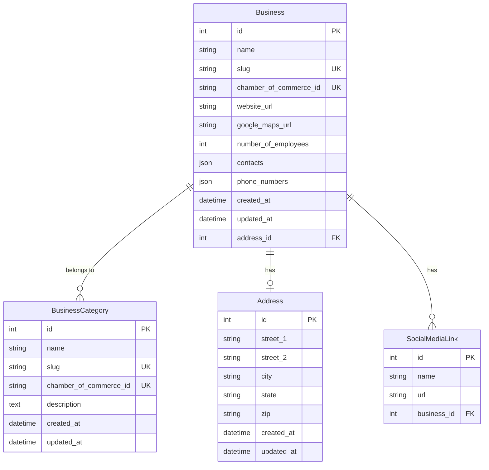
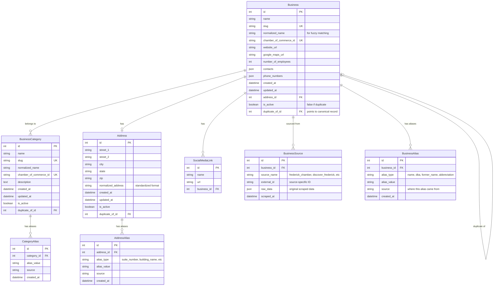

# Business Data Deduplication Strategy

## Overview

This document outlines proposals for enhanced duplicate detection, management, and merging capabilities in the Frederick Business Directory. The current system has basic deduplication logic in the `DjangoBusinessIngestionPipeline` but lacks comprehensive duplicate management tools.

## Current State Analysis

### Existing Deduplication Logic

The current pipeline (`scraper/pipelines.py`) handles duplicates with basic matching:

```python
# Business matching logic
business = models.Business.objects.get(
    Q(name=item.name)
    | Q(
        chamber_of_commerce_id=item.chamber_of_commerce_id,
        chamber_of_commerce_id__isnull=False,
    ),
)
```

### Current Limitations

1. **Fuzzy Matching**: No fuzzy name matching for businesses with slight name variations
2. **Name Aliases**: No way to store alternative names or variations for the same business
3. **Manual Review**: No interface for reviewing potential duplicates
4. **Simple Merge**: No tools to mark duplicates and consolidate records
5. **Cross-Source Matching**: Limited ability to match businesses across different scraped sources

## Entity Relationship Diagrams

### Current ERD



### Proposed ERD with Deduplication Support



## Proposed Model Changes

### 1. Enhanced Business Model (Simplified)

```python
class Business(TimestampsMixin, models.Model):
    # Existing fields
    name = models.CharField(max_length=255)
    slug = models.SlugField(unique=True, db_index=True)

    # New deduplication fields
    normalized_name = models.CharField(
        max_length=255,
        db_index=True,
        help_text="Normalized name for fuzzy matching"
    )
    is_active = models.BooleanField(
        default=True,
        help_text="False if this record is a duplicate"
    )
    duplicate_of = models.ForeignKey(
        'self',
        on_delete=models.SET_NULL,
        null=True,
        blank=True,
        help_text="Points to the canonical record if this is a duplicate"
    )

    def save(self, *args, **kwargs):
        self.normalized_name = self.normalize_name(self.name)
        super().save(*args, **kwargs)

    @staticmethod
    def normalize_name(name):
        """Normalize business name for fuzzy matching"""
        import re
        name = name.lower().strip()
        # Remove common business suffixes
        name = re.sub(r'\b(inc|llc|corp|ltd|co)\b\.?$', '', name)
        # Remove punctuation and extra spaces
        name = re.sub(r'[^\w\s]', '', name)
        name = re.sub(r'\s+', ' ', name)
        return name.strip()

    @property
    def all_names(self):
        """Get all names including aliases"""
        names = [self.name]
        names.extend([alias.alias_value for alias in self.aliases.all()])
        return names
```

### 2. Business Alias System

```python
class BusinessAlias(TimestampsMixin, models.Model):
    """Store alternative names and identifiers for businesses"""

    ALIAS_TYPE_CHOICES = [
        ('name', 'Alternative Name'),
        ('dba', 'Doing Business As'),
        ('former_name', 'Former Name'),
        ('abbreviation', 'Abbreviation'),
        ('nickname', 'Common Nickname'),
        ('legal_name', 'Legal Entity Name'),
    ]

    business = models.ForeignKey(
        Business,
        on_delete=models.CASCADE,
        related_name='aliases'
    )
    alias_type = models.CharField(max_length=20, choices=ALIAS_TYPE_CHOICES)
    alias_value = models.CharField(max_length=255, db_index=True)
    source = models.CharField(
        max_length=100,
        help_text="Where this alias came from (scraper, manual, etc.)"
    )

    class Meta:
        unique_together = [['business', 'alias_type', 'alias_value']]
        indexes = [
            models.Index(fields=['alias_value']),
            models.Index(fields=['alias_type', 'alias_value']),
        ]

    def __str__(self):
        return f"{self.business.name} -> {self.alias_value} ({self.alias_type})"
```

### 3. Category Alias System

```python
class CategoryAlias(TimestampsMixin, models.Model):
    """Store alternative names for business categories"""

    category = models.ForeignKey(
        BusinessCategory,
        on_delete=models.CASCADE,
        related_name='aliases'
    )
    alias_value = models.CharField(max_length=255, db_index=True)
    source = models.CharField(max_length=100)

    class Meta:
        unique_together = [['category', 'alias_value']]

    def __str__(self):
        return f"{self.category.name} -> {self.alias_value}"
```

### 4. Enhanced Business Source Tracking

```python
class BusinessSource(TimestampsMixin, models.Model):
    """Track which scraper/source each business came from"""

    SOURCE_CHOICES = [
        ('frederick_chamber', 'Frederick Chamber of Commerce'),
        ('discover_frederick', 'Discover Frederick'),
        ('made_in_frederick', 'Made in Frederick'),
        ('business_in_frederick', 'Business in Frederick'),
    ]

    business = models.ForeignKey(Business, on_delete=models.CASCADE)
    source_name = models.CharField(max_length=50, choices=SOURCE_CHOICES)
    external_id = models.CharField(max_length=255, null=True, blank=True)
    raw_data = models.JSONField(help_text="Original scraped data for debugging")
    scraped_at = models.DateTimeField(auto_now_add=True)

    class Meta:
        unique_together = [['business', 'source_name']]

    def __str__(self):
        return f"{self.business.name} from {self.source_name}"
```

### 5. Enhanced Models with Duplicate Support

```python
# Add duplicate_of to existing models
class BusinessCategory(TimestampsMixin, models.Model):
    # ... existing fields ...
    normalized_name = models.CharField(max_length=255, db_index=True)
    is_active = models.BooleanField(default=True)
    duplicate_of = models.ForeignKey(
        'self',
        on_delete=models.SET_NULL,
        null=True,
        blank=True
    )

    def save(self, *args, **kwargs):
        self.normalized_name = Business.normalize_name(self.name)
        super().save(*args, **kwargs)

class Address(TimestampsMixin, models.Model):
    # ... existing fields ...
    normalized_address = models.CharField(max_length=500, db_index=True)
    is_active = models.BooleanField(default=True)
    duplicate_of = models.ForeignKey(
        'self',
        on_delete=models.SET_NULL,
        null=True,
        blank=True
    )

    def save(self, *args, **kwargs):
        self.normalized_address = self.normalize_address()
        super().save(*args, **kwargs)

    def normalize_address(self):
        """Normalize address for duplicate detection"""
        parts = [self.street_1, self.city, self.state, self.zip]
        address = ' '.join(filter(None, parts)).lower()
        # Remove extra spaces and common abbreviations
        import re
        address = re.sub(r'\s+', ' ', address)
        address = re.sub(r'\bst\b', 'street', address)
        address = re.sub(r'\bave\b', 'avenue', address)
        address = re.sub(r'\brd\b', 'road', address)
        return address.strip()
```

## Proposed Management Commands

### 1. Duplicate Detection Command

```python
# management/commands/detect_duplicates.py
class Command(BaseCommand):
    help = 'Detect potential duplicate businesses and report them'

    def add_arguments(self, parser):
        parser.add_argument('--source', help='Limit to specific source')
        parser.add_argument('--threshold', type=float, default=0.8,
                          help='Similarity threshold for fuzzy matching')
        parser.add_argument('--method', default='all',
                          choices=['name', 'address', 'phone', 'website', 'all'])
        parser.add_argument('--output', help='Output CSV file for results')

    def handle(self, *args, **options):
        detector = DuplicateDetector(
            threshold=options['threshold'],
            source_filter=options.get('source')
        )

        if options['method'] == 'all':
            candidates = detector.find_all_duplicates()
        elif options['method'] == 'name':
            candidates = detector.find_name_duplicates()
        elif options['method'] == 'address':
            candidates = detector.find_address_duplicates()
        elif options['method'] == 'phone':
            candidates = detector.find_phone_duplicates()
        elif options['method'] == 'website':
            candidates = detector.find_website_duplicates()

        self.stdout.write(f"Found {len(candidates)} potential duplicate pairs")

        for i, (business1, business2, score, reason) in enumerate(candidates):
            self.stdout.write(f"{i+1}. {business1.name} <-> {business2.name}")
            self.stdout.write(f"   Score: {score:.3f}, Reason: {reason}")
            self.stdout.write(f"   IDs: {business1.id}, {business2.id}")
            self.stdout.write("")

        if options.get('output'):
            detector.export_to_csv(candidates, options['output'])
            self.stdout.write(f"Results exported to {options['output']}")
```

### 2. Mark Duplicates Command

```python
# management/commands/mark_duplicate.py
class Command(BaseCommand):
    help = 'Mark one business as a duplicate of another'

    def add_arguments(self, parser):
        parser.add_argument('duplicate_id', type=int, help='ID of business to mark as duplicate')
        parser.add_argument('canonical_id', type=int, help='ID of canonical business')
        parser.add_argument('--merge-data', action='store_true',
                          help='Merge data from duplicate into canonical before marking')
        parser.add_argument('--add-alias', action='store_true',
                          help='Add duplicate name as alias to canonical business')
        parser.add_argument('--dry-run', action='store_true')

    def handle(self, *args, **options):
        try:
            duplicate = Business.objects.get(id=options['duplicate_id'])
            canonical = Business.objects.get(id=options['canonical_id'])
        except Business.DoesNotExist as e:
            self.stderr.write(f"Business not found: {e}")
            return

        if duplicate.duplicate_of:
            self.stderr.write(f"Business {duplicate.id} is already marked as duplicate of {duplicate.duplicate_of.id}")
            return

        if options['dry_run']:
            self.stdout.write("DRY RUN - would perform the following actions:")

        if options['merge_data']:
            merger = SimpleBusinessMerger()
            if options['dry_run']:
                preview = merger.preview_merge(duplicate, canonical)
                self.stdout.write(f"Would merge data: {preview}")
            else:
                merger.merge_data(duplicate, canonical)
                self.stdout.write("Merged data from duplicate to canonical")

        if options['add_alias']:
            if options['dry_run']:
                self.stdout.write(f"Would add alias: {duplicate.name} -> {canonical.name}")
            else:
                BusinessAlias.objects.get_or_create(
                    business=canonical,
                    alias_type='former_name',
                    alias_value=duplicate.name,
                    defaults={'source': 'manual_merge'}
                )
                self.stdout.write(f"Added alias: {duplicate.name}")

        if not options['dry_run']:
            duplicate.is_active = False
            duplicate.duplicate_of = canonical
            duplicate.save()
            self.stdout.write(f"Marked business {duplicate.id} as duplicate of {canonical.id}")
```

### 3. Create Alias Command

```python
# management/commands/create_alias.py
class Command(BaseCommand):
    help = 'Create aliases for businesses, categories, or addresses'

    def add_arguments(self, parser):
        parser.add_argument('entity_type', choices=['business', 'category', 'address'])
        parser.add_argument('entity_id', type=int)
        parser.add_argument('alias_value', help='The alias value to add')
        parser.add_argument('--alias-type', default='name',
                          help='Type of alias (for businesses)')
        parser.add_argument('--source', default='manual',
                          help='Source of this alias')

    def handle(self, *args, **options):
        entity_type = options['entity_type']
        entity_id = options['entity_id']
        alias_value = options['alias_value']

        try:
            if entity_type == 'business':
                business = Business.objects.get(id=entity_id)
                alias, created = BusinessAlias.objects.get_or_create(
                    business=business,
                    alias_type=options['alias_type'],
                    alias_value=alias_value,
                    defaults={'source': options['source']}
                )
                if created:
                    self.stdout.write(f"Created business alias: {business.name} -> {alias_value}")
                else:
                    self.stdout.write(f"Alias already exists: {business.name} -> {alias_value}")

            elif entity_type == 'category':
                category = BusinessCategory.objects.get(id=entity_id)
                alias, created = CategoryAlias.objects.get_or_create(
                    category=category,
                    alias_value=alias_value,
                    defaults={'source': options['source']}
                )
                if created:
                    self.stdout.write(f"Created category alias: {category.name} -> {alias_value}")
                else:
                    self.stdout.write(f"Alias already exists: {category.name} -> {alias_value}")

        except (Business.DoesNotExist, BusinessCategory.DoesNotExist) as e:
            self.stderr.write(f"Entity not found: {e}")
```

### 4. List Duplicates Command

```python
# management/commands/list_duplicates.py
class Command(BaseCommand):
    help = 'List all businesses marked as duplicates'

    def add_arguments(self, parser):
        parser.add_argument('--show-canonical', action='store_true',
                          help='Show canonical business details')
        parser.add_argument('--format', choices=['table', 'csv'], default='table')

    def handle(self, *args, **options):
        duplicates = Business.objects.filter(
            is_active=False,
            duplicate_of__isnull=False
        ).select_related('duplicate_of')

        if not duplicates.exists():
            self.stdout.write("No duplicate businesses found")
            return

        if options['format'] == 'table':
            for dup in duplicates:
                self.stdout.write(f"Duplicate: {dup.name} (ID: {dup.id})")
                self.stdout.write(f"  -> Canonical: {dup.duplicate_of.name} (ID: {dup.duplicate_of.id})")
                if options['show_canonical']:
                    self.stdout.write(f"  -> Address: {dup.duplicate_of.address}")
                    self.stdout.write(f"  -> Categories: {', '.join([c.name for c in dup.duplicate_of.categories.all()])}")
                self.stdout.write("")

        elif options['format'] == 'csv':
            import csv
            import sys
            writer = csv.writer(sys.stdout)
            writer.writerow(['duplicate_id', 'duplicate_name', 'canonical_id', 'canonical_name'])
            for dup in duplicates:
                writer.writerow([dup.id, dup.name, dup.duplicate_of.id, dup.duplicate_of.name])
```

## Duplicate Detection Algorithms

### 1. Name-Based Fuzzy Matching

```python
class DuplicateDetector:
    def __init__(self, threshold=0.8, source_filter=None):
        self.threshold = threshold
        self.source_filter = source_filter

    def find_name_duplicates(self):
        """Find businesses with similar names using fuzzy matching"""
        from difflib import SequenceMatcher

        businesses = Business.objects.filter(is_active=True)
        if self.source_filter:
            businesses = businesses.filter(sources__source_name=self.source_filter)

        candidates = []
        business_list = list(businesses)

        for i, business1 in enumerate(business_list):
            for business2 in business_list[i+1:]:
                similarity = SequenceMatcher(
                    None,
                    business1.normalized_name,
                    business2.normalized_name
                ).ratio()

                if similarity >= self.threshold:
                    candidates.append(self.create_candidate(
                        business1, business2, similarity, 'name_fuzzy'
                    ))

        return candidates

    def find_address_duplicates(self):
        """Find businesses at the same address"""
        from django.db.models import Count

        # Find addresses with multiple businesses
        duplicate_addresses = Address.objects.annotate(
            business_count=Count('business')
        ).filter(business_count__gt=1)

        candidates = []
        for address in duplicate_addresses:
            businesses = address.business_set.filter(is_active=True)
            business_list = list(businesses)

            for i, business1 in enumerate(business_list):
                for business2 in business_list[i+1:]:
                    candidates.append(self.create_candidate(
                        business1, business2, 1.0, 'address_exact'
                    ))

        return candidates
```

### 2. Phone and Website Matching

```python
def find_contact_duplicates(self):
    """Find businesses with matching phone numbers or websites"""
    candidates = []

    # Phone number matching
    phone_map = {}
    for business in Business.objects.filter(is_active=True):
        for phone in business.phone_numbers:
            cleaned_phone = self.clean_phone_number(phone)
            if cleaned_phone in phone_map:
                candidates.append(self.create_candidate(
                    phone_map[cleaned_phone], business, 0.9, 'phone_match'
                ))
            else:
                phone_map[cleaned_phone] = business

    # Website matching
    website_businesses = Business.objects.filter(
        is_active=True,
        website_url__isnull=False
    ).exclude(website_url='')

    website_map = {}
    for business in website_businesses:
        normalized_url = self.normalize_url(business.website_url)
        if normalized_url in website_map:
            candidates.append(self.create_candidate(
                website_map[normalized_url], business, 0.95, 'website_match'
            ))
        else:
            website_map[normalized_url] = business

    return candidates
```

## Simple Business Merger Logic

```python
class SimpleBusinessMerger:
    """Simplified business merger without complex history tracking"""

    def merge_data(self, source_business, target_business):
        """Merge data from source into target business"""
        updated_fields = []

        # Merge address if target doesn't have one
        if source_business.address and not target_business.address:
            target_business.address = source_business.address
            updated_fields.append('address')

        # Merge employee count (prefer higher value)
        if source_business.number_of_employees:
            if not target_business.number_of_employees or \
               source_business.number_of_employees > target_business.number_of_employees:
                target_business.number_of_employees = source_business.number_of_employees
                updated_fields.append('number_of_employees')

        # Merge phone numbers (combine unique values)
        if source_business.phone_numbers:
            all_phones = set(source_business.phone_numbers + target_business.phone_numbers)
            target_business.phone_numbers = list(all_phones)
            updated_fields.append('phone_numbers')

        # Merge contacts (combine unique values)
        if source_business.contacts:
            all_contacts = source_business.contacts + target_business.contacts
            unique_contacts = list(dict.fromkeys(all_contacts))  # Preserve order, remove duplicates
            target_business.contacts = unique_contacts
            updated_fields.append('contacts')

        # Merge website (prefer https)
        if source_business.website_url and not target_business.website_url:
            target_business.website_url = source_business.website_url
            updated_fields.append('website_url')
        elif source_business.website_url and source_business.website_url.startswith('https://') \
             and target_business.website_url and not target_business.website_url.startswith('https://'):
            target_business.website_url = source_business.website_url
            updated_fields.append('website_url')

        # Merge categories
        source_categories = set(source_business.categories.all())
        target_categories = set(target_business.categories.all())
        new_categories = source_categories - target_categories
        for category in new_categories:
            target_business.categories.add(category)

        # Merge social media links
        for social_link in source_business.socialmedialink_set.all():
            target_business.socialmedialink_set.get_or_create(
                name=social_link.name,
                defaults={'url': social_link.url}
            )

        # Merge business sources
        for source_record in source_business.businesssource_set.all():
            target_business.businesssource_set.get_or_create(
                source_name=source_record.source_name,
                defaults={
                    'external_id': source_record.external_id,
                    'raw_data': source_record.raw_data,
                    'scraped_at': source_record.scraped_at,
                }
            )

        if updated_fields:
            target_business.save(update_fields=updated_fields)

        return updated_fields

    def preview_merge(self, source_business, target_business):
        """Preview what would be merged without actually doing it"""
        preview = {
            'source_id': source_business.id,
            'source_name': source_business.name,
            'target_id': target_business.id,
            'target_name': target_business.name,
            'changes': []
        }

        if source_business.address and not target_business.address:
            preview['changes'].append(f"Add address: {source_business.address}")

        if source_business.number_of_employees and \
           (not target_business.number_of_employees or
            source_business.number_of_employees > target_business.number_of_employees):
            preview['changes'].append(f"Update employee count: {source_business.number_of_employees}")

        if source_business.phone_numbers:
            new_phones = set(source_business.phone_numbers) - set(target_business.phone_numbers)
            if new_phones:
                preview['changes'].append(f"Add phone numbers: {list(new_phones)}")

        if source_business.website_url and not target_business.website_url:
            preview['changes'].append(f"Add website: {source_business.website_url}")

        source_categories = set(source_business.categories.values_list('name', flat=True))
        target_categories = set(target_business.categories.values_list('name', flat=True))
        new_categories = source_categories - target_categories
        if new_categories:
            preview['changes'].append(f"Add categories: {list(new_categories)}")

        return preview
```

## Implementation Roadmap

### Phase 1: Core Models and Migration (Week 1)
1. Add new fields to existing models (`normalized_name`, `is_active`, `duplicate_of`)
2. Create alias models (`BusinessAlias`, `CategoryAlias`)
3. Create `BusinessSource` model for source tracking
4. Generate and run Django migrations

### Phase 2: Detection Commands (Week 2)
1. Implement `DuplicateDetector` class with fuzzy matching algorithms
2. Create `detect_duplicates` management command
3. Add CSV export functionality for duplicate candidates
4. Test detection algorithms on existing data

### Phase 3: Management Tools (Week 3)
1. Create `mark_duplicate` management command
2. Create `create_alias` and `list_duplicates` commands
3. Implement `SimpleBusinessMerger` class
4. Add Django admin interface for aliases and duplicates

### Phase 4: Pipeline Integration (Week 4)
1. Update scraper pipelines to create `BusinessSource` records
2. Enhance pipeline to check aliases during matching
3. Add automatic alias creation for name variations
4. Test end-to-end workflow with new scraped data

## Command Usage Examples

```bash
# Detect potential duplicates
python manage.py detect_duplicates --method=name --threshold=0.85 --output=duplicates.csv

# Mark a business as duplicate and merge data
python manage.py mark_duplicate 123 456 --merge-data --add-alias

# Create an alias for a business
python manage.py create_alias business 456 "ABC Corporation" --alias-type=legal_name

# List all current duplicates
python manage.py list_duplicates --show-canonical

# Detect duplicates from specific source
python manage.py detect_duplicates --source=frederick_chamber --method=all
```

## Testing Strategy

```python
# tests/test_deduplication.py
class DuplicateDetectionTest(TestCase):
    def test_name_normalization(self):
        """Test business name normalization"""
        self.assertEqual(
            Business.normalize_name("Joe's Pizza, Inc."),
            "joes pizza"
        )
        self.assertEqual(
            Business.normalize_name("ABC Corp & Co LLC"),
            "abc corp"
        )

    def test_fuzzy_name_matching(self):
        """Test fuzzy name matching algorithm"""
        business1 = Business.objects.create(name="Joe's Pizza Inc")
        business2 = Business.objects.create(name="Joes Pizza LLC")

        detector = DuplicateDetector(threshold=0.8)
        candidates = detector.find_name_duplicates()

        self.assertEqual(len(candidates), 1)
        self.assertGreaterEqual(candidates[0][2], 0.8)  # Score

    def test_alias_creation(self):
        """Test business alias creation"""
        business = Business.objects.create(name="ABC Corporation")
        alias = BusinessAlias.objects.create(
            business=business,
            alias_type='dba',
            alias_value='ABC Corp',
            source='manual'
        )

        self.assertIn('ABC Corp', business.all_names)
        self.assertIn('ABC Corporation', business.all_names)

    def test_simple_merge(self):
        """Test simple business data merging"""
        source = Business.objects.create(
            name="ABC Corp",
            number_of_employees=50,
            phone_numbers=["555-1234"]
        )
        target = Business.objects.create(
            name="ABC Corporation",
            website_url="https://abc.com",
            phone_numbers=["555-5678"]
        )

        merger = SimpleBusinessMerger()
        updated_fields = merger.merge_data(source, target)

        target.refresh_from_db()
        self.assertEqual(target.number_of_employees, 50)   # Source data merged
        self.assertIn("555-1234", target.phone_numbers)    # Phones combined
        self.assertIn("555-5678", target.phone_numbers)
        self.assertEqual(target.website_url, "https://abc.com")  # Target preserved

    def test_duplicate_marking(self):
        """Test marking business as duplicate"""
        duplicate = Business.objects.create(name="Duplicate Business")
        canonical = Business.objects.create(name="Canonical Business")

        # Mark as duplicate
        duplicate.is_active = False
        duplicate.duplicate_of = canonical
        duplicate.save()

        self.assertFalse(duplicate.is_active)
        self.assertEqual(duplicate.duplicate_of, canonical)

        # Test filtering active businesses
        active_businesses = Business.objects.filter(is_active=True)
        self.assertIn(canonical, active_businesses)
        self.assertNotIn(duplicate, active_businesses)
```

## Current Data Analysis Results

Based on running the `detect_duplicates` command on the existing Frederick Business Directory data (727 businesses), we identified **41 potential duplicate pairs** with **38 having high confidence scores (≥0.9)**. The analysis reveals several patterns in the duplicate data:

### Key Findings from Real Data

#### 1. Business Name Variations (16 matches via name_fuzzy)
The most common duplicates are businesses with slight name variations, often involving:

**Perfect Name Matches (Score = 1.0):**
- **Monocacy Brewing Company** ↔ **Monocacy Brewing CO** (IDs: 84, 702)
- **Centro Hispano de Frederick, Inc.** ↔ **Centro Hispano De Frederick** (IDs: 195, 425)
- **Idiom Brewing Co.** ↔ **Idiom Brewing** (IDs: 317, 683)
- **Thermo Fisher Scientific** ↔ **Thermo Fisher Scientific Inc** (IDs: 356, 703)
- **STULZ Air Technology Systems, Inc.** ↔ **STULZ Air Technology Systems** (IDs: 363, 621)
- **Attaboy Beer Co** ↔ **Attaboy Beer** (IDs: 401, 606)

**Near-Perfect Matches (Score ≥ 0.98):**
- **C&A FINANCIAL SERVICES CPA OFFICES** ↔ **CNA Financial Services CPA Offices** (Score: 0.985, IDs: 46, 430)
  - Likely a data entry error where "C&A" should be "CNA"

**Common Patterns:**
- Legal suffixes: "Inc", "LLC", "Co", "Corporation" vs. without
- Punctuation differences: "Co." vs "Co"
- Capitalization variations: "CPA OFFICES" vs "CPA Offices"

#### 2. Shared Addresses (14 matches via address_exact)
Many businesses share the same physical address, indicating business complexes, office buildings, or shared spaces:

**Business Parks/Complexes:**
- **50 Citizens Way, Frederick** - 3 different businesses:
  - Colbert/Ball Tax SVC
  - Octavo Designs  
  - PPR Strategies
- **5100 Buckeystown Pike, Frederick** - 3 different businesses:
  - Mid Atlantic Snow Services, Inc.
  - Mjach Designs
  - Venlu Cloud Consulting

**Healthcare Campus:**
- **1 Frederick Health Way, Frederick** - 2 related organizations:
  - Coalition for a Healthier Frederick County
  - Frederick Health Hospice

**Technology Center:**
- **4539 Metropolitan Ct, Frederick** - 2 nonprofit organizations:
  - Frederick Innovative Technology Center, Inc.
  - SCORE Frederick, Chapter 632

#### 3. Website Matches (7 matches via website_match)
Businesses sharing the same website are strong indicators of true duplicates:

**Definite Duplicates:**
- **DeLeon & Stang CPAs** (Frederick & Gaithersburg locations) - same website: deleonandstang.com
- **AstraZeneca Biologics Manufacturing Center** ↔ **AstraZeneca** - same website: astrazeneca.com
- **Mount St. Mary's University** ↔ **Mount Saint Mary's University** - same website: msmary.edu
- **Brewer's Alley Restaurant & Brewery** ↔ **Brewer's Alley** - same website: brewers-alley.com

**Organizational Relationships:**
- **Frederick County Chamber of Commerce** ↔ **Generation Connect** - same website: frederickchamber.org
  - Indicates Generation Connect may be a program of the Chamber

#### 4. Phone Number Matches (4 matches via phone_match)
Same phone numbers indicate either duplicates or closely related businesses:

**Data Quality Issues:**
- **Patrick Street Interiors** - appears to be duplicated with same ID (26)

**Related Organizations:**
- **Goodwill Industries of Monocacy Valley Inc.** ↔ **Platoon Veteran Services Center at Goodwill**
  - Same phone: 301-662-0622 - Platoon is likely a program within Goodwill

**Business Relationships:**
- **Plamondon Companies** ↔ **Roy Rogers Restaurants & Catering**
  - Same phone: 301-695-5051 - Plamondon likely manages Roy Rogers location

### Summary Statistics

- **Total Businesses Analyzed**: 727
- **Potential Duplicate Pairs Found**: 41
- **High Confidence Duplicates (≥0.9)**: 38 (93%)
- **Perfect Score Matches (1.0)**: 23 (56%)

**Detection Method Effectiveness:**
1. **Name Fuzzy Matching**: 16 pairs (39%) - Most effective for true duplicates
2. **Address Exact Matching**: 14 pairs (34%) - Reveals business relationships and shared spaces
3. **Website Matching**: 7 pairs (17%) - High precision for duplicate detection
4. **Phone Matching**: 4 pairs (10%) - Good for related organizations

### Recommended Actions

Based on this analysis, the following businesses should be prioritized for manual review and potential merging:

**Immediate Action (Perfect Matches):**
1. Monocacy Brewing entries (IDs: 84, 702)
2. Idiom Brewing entries (IDs: 317, 683)  
3. Thermo Fisher Scientific entries (IDs: 356, 703)
4. STULZ Air Technology Systems entries (IDs: 363, 621)
5. Attaboy Beer entries (IDs: 401, 606)

**High Priority Review (Near-Perfect Matches):**
1. C&A vs CNA Financial Services (IDs: 46, 430) - Likely data entry error
2. Centro Hispano de Frederick entries (IDs: 195, 425) - Possible address change
3. AstraZeneca entries (IDs: 109, 359) - Same company, different descriptions

This analysis demonstrates the effectiveness of the duplicate detection algorithms and provides a clear roadmap for data cleanup efforts.

This simplified deduplication strategy focuses on practical duplicate management with minimal overhead while providing powerful tools for maintaining data quality through aliases and simple duplicate relationships.

